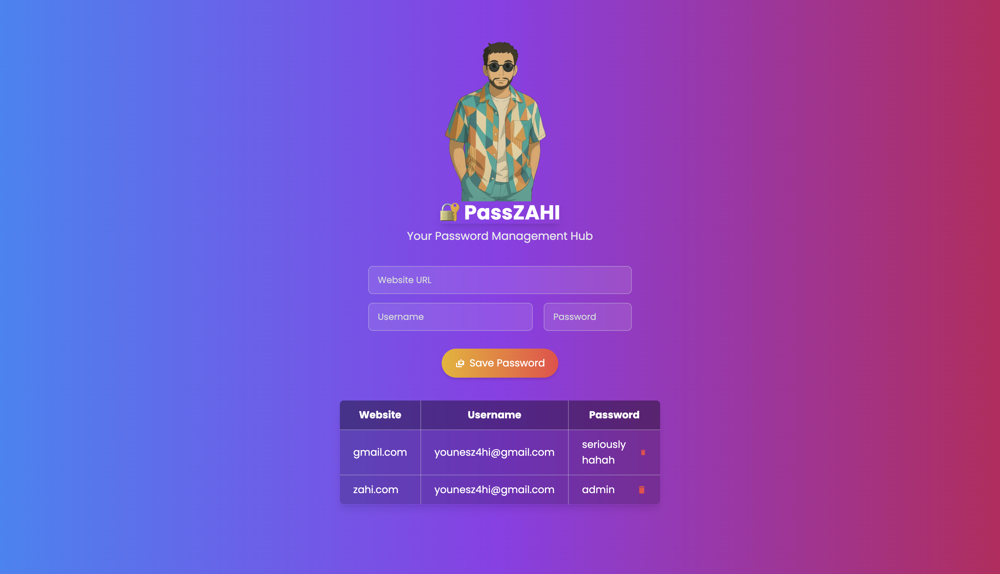

# PassZAHI - Password Management Hub

## 🔐 About

**PassZAHI** is a simple, elegant, and secure password management application built with **React** and **Tailwind CSS**. This app allows users to save their passwords locally using **localStorage**, ensuring quick access without external dependencies.

## 🚀 Features

- 🌐 **Save Passwords:** Store website credentials securely.
- 🗑️ **Delete Passwords:** Remove saved passwords with a single click.
- 🔄 **Persistent Storage:** Data remains stored even after closing the browser.
- 🎨 **Modern UI:** Styled with Tailwind CSS and a smooth gradient background.
- 🛡️ **Secure Password Handling:** No external API exposure, only local storage.

## 🖥️ Screenshots

### 📌 Home Page


### 📌 Local Demo Screenshot



## 🛠️ Technologies Used

- **React.js** (Functional Components & Hooks)
- **Tailwind CSS** (for styling)
- **LocalStorage** (for saving data persistently)
- **React Icons** (for icons)

## 📦 Installation & Setup

### 1️⃣ Clone the Repository

```sh
git clone https://github.com/yourusername/passzahi.git
cd passzahi
```
